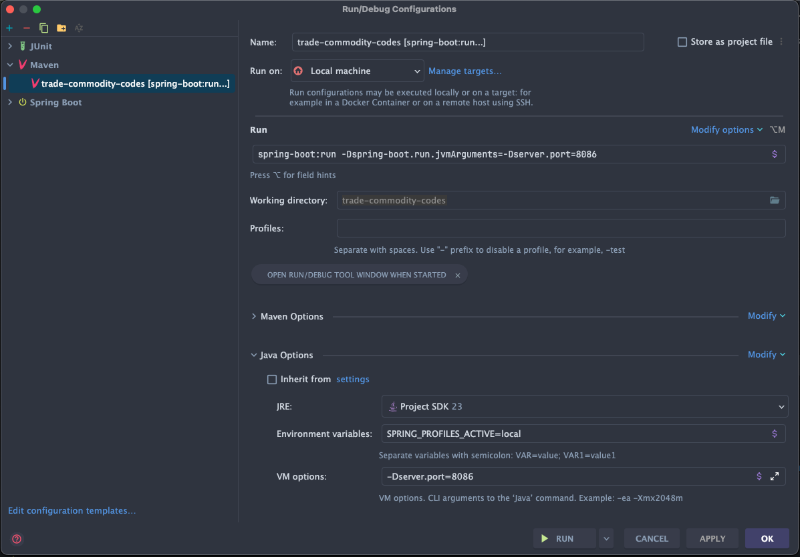

The curent p# Trade Commodity Codes

Spring Boot 3.2.11 backend for the Core Delivery Platform (CDP)


## What is this?

A CDP-compliant Spring Boot backend that demonstrates:
- Full CRUD operations with Postgres
- ECS JSON logging with trace ID propagation
- HTTP proxy configuration for outbound requests
- Actuator endpoints with production security defaults

---

## Quick Start

This application requires data in the form of commodity codes. Head to 
https://drive.google.com/file/d/15VuC-SjIMPAZ98jEI1kH5AY5KvpRzTva/view?usp=drive_link to download
a zip file which contains a data folder. Store this at the root of this project. Then
when running the project via docker, the data will be loaded automatically. See the liquibase-data
step in the docker compose file for more details.

### Local Development

All infrastructure dependencies are centrally managed in `../trade-demo-local`. Choose the workflow that fits your needs:

#### Option 1: Backend in Docker (Production-like)

Run everything in Docker, including this backend service:

```bash
# Start infrastructure + all backend services
cd ../trade-demo-local
docker compose --profile services up -d

# After code changes to this service:
cd ../trade-commodity-codes
docker compose up --build
```

**Pros:** Production-like environment
**Cons:** Slower iteration (~30-60s per rebuild)

#### Option 2: Native Backend (Fastest for Active Development)

Run infrastructure in Docker, this backend natively for hot reload:

```bash
# Terminal 1: Start infrastructure only
cd ../trade-demo-local
docker compose --profile infra up -d

# Terminal 2: Run this backend natively (hot reload)
cd ../trade-commodity-codes
mvn spring-boot:run
```
Or to use the IDE:



**Pros:** Fast iteration, Spring Boot DevTools hot reload, easy debugging
**Cons:** None

#### Option 3: Individual Service in Docker

When you need to test just this service's Docker image:

```bash
# Terminal 1: Start infrastructure
cd ../trade-demo-local
docker compose --profile infra up -d

# Terminal 2: Start just this backend service
cd ../trade-commodity-codes
docker compose up --build
```

**Pros:** Tests actual Docker image without starting other services
**Cons:** Slower than native execution

All endpoints support trace ID propagation via `x-cdp-request-id` header.

See `../trade-demo-local/README.md` for more infrastructure management options.


---

### Useful Docker Commands

```bash
# View logs for specific service
docker compose logs -f trade-commodity-codes

# Rebuild specific service
docker compose up --build trade-commodity-codes

# Access container shell
docker compose exec trade-commodity-codes sh

# Remove everything including volumes
docker compose down -v

# Check service health
docker compose ps

# Identify any cloudwatch logged metrics
docker exec -it trade-commodity-codes-localstack-1 /bin/bash
awslocal cloudwatch list-metrics

```

### Metrics System

This service implements comprehensive metrics collection using Micrometer and AWS Embedded Metrics Format (EMF).

#### Architecture

**Collection Layer:**
- **Micrometer**: Collects JVM, HTTP, and database metrics via Spring Boot Actuator
- **Spring AOP**: Instruments controller methods with `@Timed` annotations for request duration tracking
- **Custom Aspects**: `TimedAspect` and `CountedAspect` beans enable annotation-based metrics

**Publishing Layer:**
- **EmfMetricsPublisher**: Scheduled service (every 60 seconds) that publishes metrics to CloudWatch
- **Auto-cleanup**: Controller metrics are removed after publishing to prevent unbounded growth
- **Namespace**: Configurable via `aws.emf.namespace` property

#### Standard Metrics Collected

**JVM Metrics** (when `management.metrics.enable.jvm.*=true`):
- `jvm.memory.committed` - Memory committed to JVM
- `jvm.memory.used` - Memory currently used
- `jvm.memory.max` - Maximum memory available
- `jvm.threads.live` - Current thread count
- `jvm.threads.peak` - Peak thread count

**Database Metrics** (when `management.metrics.enable.hikaricp.*=true`):
- `hikaricp.connections.active` - Active database connections
- `hikaricp.connections.idle` - Idle database connections

**Controller Metrics** (via `@Timed` annotations):
- `controller.{methodName}.time` - Request duration for each endpoint
- Published every 60 seconds, then cleaned up automatically

#### Configuration

**Enable/Disable Metrics:**
```yaml
management:
  metrics:
    enabled: ${METRICS_ENABLED:false}  # Default: disabled in production
```

**Local Development:**
```bash
# Start with metrics enabled
METRICS_ENABLED=true mvn spring-boot:run

# View metrics (requires dev profile)
curl http://localhost:8086/metrics
```

**Production:**
- Metrics endpoint not exposed (security by default)
- Enable via `METRICS_ENABLED=true` environment variable
- Published to CloudWatch via EMF format

#### Viewing Metrics in LocalStack

```bash
# Access LocalStack container
docker exec -it trade-commodity-codes-localstack-1 /bin/bash

# List all metrics
awslocal cloudwatch list-metrics

# Get metric statistics
awslocal cloudwatch get-metric-statistics \
  --namespace TradeCommodityCodes \
  --metric-name controller.getTopLevelDuration.time \
  --start-time 2025-01-01T00:00:00Z \
  --end-time 2025-12-31T23:59:59Z \
  --period 3600 \
  --statistics Average,Maximum,Minimum
```

#### Testing

**Unit Tests:**
- `MetricsConfigTest`: Validates bean registration for `TimedAspect` and `CountedAspect`
- `EmfMetricsPublisherTest`: Tests metrics publishing and controller metric cleanup

**Integration Tests:**
- `CommodityCodeResourceMetricsIntegrationTest`: Verifies `@Timed` annotations record metrics

**Test Profile Behavior:**
Metrics are disabled in test profile. No mocking required - inject `MeterRegistry` normally:

```java
@Autowired
private MeterRegistry meterRegistry;

@Test
void testSomething() {
    // Metrics work normally in tests when explicitly enabled
    meterRegistry.counter("test.metric").increment();
}
```

#### Adding New Metrics

**Controller Timing:**
```java
@Timed("controller.yourMethodName.time")
@GetMapping("/your-endpoint")
public ResponseEntity<YourDto> yourMethod() {
    // Implementation
}
```

**Custom Counters:**
```java
@Autowired
private MeterRegistry meterRegistry;

public void yourBusinessLogic() {
    meterRegistry.counter("business.operation.count").increment();
}
```

#### Troubleshooting

**No metrics appearing in CloudWatch:**
1. Check `METRICS_ENABLED=true` is set
2. Verify EMF publisher is running: Check logs for "Publishing metrics for"
3. Confirm LocalStack is running: `docker compose ps localstack`

**Metrics growing unbounded:**
- Controller metrics (prefix `controller.`) are automatically cleaned up after publishing
- Non-controller metrics persist by design for long-term monitoring

**High memory usage:**
- Review metric cardinality - avoid high-cardinality tags (e.g., user IDs, trace IDs)
- Consider reducing metric retention or publishing frequency

---

### Querying Logs in Grafana

If your organization uses Grafana with OpenSearch datasource:

**Find errors with stack traces:**
```lucene
service.name:"trade-commodity-codes" AND log.level:"ERROR" AND _exists_:error.stack_trace
```

**Find all errors (to verify service is logging):**
```lucene
service.name:"trade-commodity-codes" AND log.level:"ERROR"
```

**View specific error types:**
```lucene
service.name:"trade-commodity-codes" AND error.type:"java.lang.IllegalArgumentException"
```

### Verifying Field Mappings

Check which error fields are available in OpenSearch:

```json
GET /cdp-logs-*/_mapping/field/error.*
```

This shows all `error.*` field mappings. The `error.stack_trace` field should be type `text` with a `keyword` subfield:

```json
{
  "cdp-logs-2025.10.18": {
    "mappings": {
      "error.stack_trace": {
        "full_name": "error.stack_trace",
        "mapping": {
          "stack_trace": {
            "type": "text",
            "fields": {
              "keyword": {
                "type": "keyword",
                "ignore_above": 256
              }
            }
          }
        }
      }
    }
  }
}
```

---

## Available Experiments

The service exposes two types of endpoints: production-ready CRUD operations and temporary debug experiments for verifying CDP compliance.


**Get debug info:**

Returns current service configuration including service name/version, environment, EMF enabled status, namespace, and logging encoder type.

```bash
curl http://localhost:8086/debug/info \
  -H "x-cdp-request-id: test-trace-123"
```

Returns: Current service configuration for troubleshooting

**Note:** Debug endpoints emit structured ECS JSON logs with trace IDs that can be queried in OpenSearch Dashboards or CloudWatch Logs Insights.
---